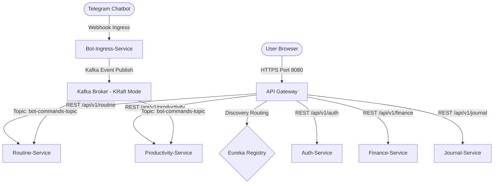

# 🎯 Naqashly Life OS (Distributed Productivity & Observability Engine)

Naqashly is a production-grade, distributed Life OS platform designed for multi-tenant habit tracking, secure cryptography, dynamic solar calculations, and high-performance execution.

---

## 🏛️ System Architecture

Naqashly is built as a **Distributed Microservices System** using Spring Boot, Netflix Eureka service discovery, Spring Cloud Gateway, and Apache Kafka.



---

## 🚀 Key Architectural Pillars & Features

### 📨 1. Decoupled Asynchronous Messaging (Kafka KRaft)
* **Zookeeperless Broker Topology**: Run using **Apache Kafka 3.7.0** in KRaft mode, combining controller and broker states to minimize container footprints.
* **Stateless Webhook Ingress**: The `bot-ingress-service` consumes webhook commands from chat applications (Telegram/WhatsApp) and translates them into JSON events published to `bot-commands-topic` in under **30ms**.
* **Idempotent Consumers**: Downstream services use a Postgres `processed_events` transaction check to filter duplicate event deliveries.
* **Dead Letter Queue (DLQ)**: Failing event logs are automatically redirected to `bot-commands-topic.DLQ` after 3 retries, preventing Head-of-Line blocking in the consumer pipeline.

### ☀️ 2. Algorithmic Real-Time Solar Engine
* **Astronomical Calculations**: A mathematical engine (`solarCalculator.js`) calculates precise solar angles, sunrise, sunset, and solar boundaries based on GPS coordinates.
* **Dynamic Grid Interpolation**: Calendar scheduling time blocks dynamically adjust start/end boundaries based on computed solar presets (e.g. locking morning blocks relative to Fajr prayer boundaries).

### 🛡️ 3. Zero-Knowledge Cryptography Vault
* **Client-Side Encryption**: Vault notes are encrypted using AES-256 in the browser before being transmitted to `journal-service`. The server only ever stores ciphertexts.
* **Decryption Testing**: A verification token note (`__VAULT_VERIFIER__`) is decrypted client-side to test passphrase validity before revealing vault data.

### 🔍 4. Distributed Tracing & Observability
* **MDC Trace Correlation**: A Gateway filter stamps requests with a unique `X-Correlation-Id`, which is propagated down REST endpoints and thread-local **MDC (Mapped Diagnostic Context)** logs.
* **Loki Log Shipping**: Containerized **Promtail** agents monitor Docker sockets and stream microservice JSON logs to a centralized **Grafana Cloud Loki** dashboard.

---

## 🛠️ Stack Configuration

* **Backend**: Java 17, Spring Boot 3.x, Spring Cloud Gateway, Netflix Eureka, Spring JPA
* **Frontend**: React (Vite), Axios, Tailwind CSS
* **Infrastructure**: PostgreSQL 16, Apache Kafka 3.7.0 (KRaft), Redis (Blacklist Cache), Docker, Promtail

---

## ⚙️ How to Run Locally

### Prerequisites
* Java 17+ & Node.js 20+
* PostgreSQL running locally on port `5433`
* Apache Kafka running on port `9092`

### 1. Launch Backend Microservices
Run the dev services script to start the servers:
```bash
./run-dev-services.bat
```

### 2. Launch Frontend Dev Server
Navigate to the frontend folder, install dependencies, and run:
```bash
cd frontend
npm install
npm run dev
```

---

## 🐋 Production Deployment (Docker Compose)

To spin up the production ecosystem (including the Promtail log shipper):

1. Copy the environment template:
   ```bash
   cp infrastructure/.env.example infrastructure/.env
   ```
2. Fill in your secrets and Grafana Cloud credentials:
   ```env
   GRAFANA_LOKI_URL=https://logs-prod-xxx.grafana.net/loki/api/v1/push
   GRAFANA_LOKI_USER=1717567
   GRAFANA_LOKI_API_KEY=your_grafana_cloud_api_key_here
   ```
3. Run docker compose:
   ```bash
   docker compose -f infrastructure/docker-compose.prod.yml up -d
   ```
